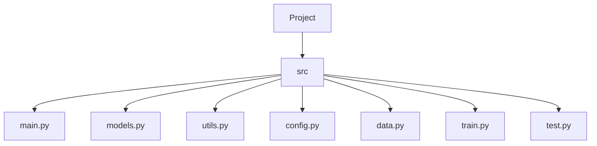

# Project Structure

## Overview



## Structure

```mermaid
fermi_paradox/
├── src/
│   ├── fermi_paradox/
│   │   ├── __init__.py
│   │   ├── main.py
│   │   │       # Flask (or FastAPI) app entrypoint.
│   │   │       #   Responsible ONLY for creating/starting the app.
│   │   │       #   No business logic should live here.
│   │   │   
│   │   ├── config/
│   │   │   ├── __init__.py
│   │   │   ├── settings.py
│   │   │   │   # Global configuration for the web app.
│   │   │   │   # Environment variables, debug flags, logging setup.
│   │   │   └── drake_params.py
│   │   │       # Centralized Drake Equation parameter defaults + presets.
│   │   │       # (Optimistic, pessimistic, conservative, rare-earth model.)
│   │   │
│   │   ├── core/
│   │   │   ├── __init__.py
│   │   │   ├── drake_equation.py
│   │   │   │   # Pure scientific logic for calculating the Drake number.
│   │   │   │   # No web framework. No ML. Just math + validation.
│   │   │   │   # This is your “physics engine” for Section 1 of the project.
│   │   │   ├── galaxy_simulation.py
│   │   │   │   # Monte Carlo simulation engine for civilizations in the galaxy.
│   │   │   │   # Supports random galaxy generation, probability distributions,
│   │   │   │   # visualization-friendly output, and future ML surrogate models.
│   │   │   ├── probability_models.py
│   │   │   │   # Foundation for SETI-style signal analysis.
│   │   │   │   # Early statistical functions, FFT prep, noise modeling, etc.
│   │   │   │   # Future home for “Probability Detection” page backend.
│   │   │   └── visualization.py
│   │   │       # Central location for plotting logic:
│   │   │       # Drake results, galaxy scatter plots, histograms, heatmaps, etc.
│   │   │       # Keeps Matplotlib/Plotly code isolated from logic.
│   │   │
│   │   ├── ml/
│   │   │   │       # Future ML modules — empty now but structured for expansion.
│   │   │   │       # Adds depth to the project WITHOUT requiring ML today.
│   │   │   ├── __init__.py
│   │   │   ├── surrogate/
│   │   │   │       # Placeholder for ML surrogate models
│   │   │   │       # (e.g., predicting simulation outcomes without running MC).
│   │   │   └── signal_detection/
│   │   │       # Placeholder for CNN / FFT-based signal classifier.
│   │   │       # Eventually supports SETI-like “Is this signal artificial?” page.
│   │   │
│   │   ├── api/
│   │   │   ├── __init__.py
│   │   │   ├── forms/          # WTForms or similar for handling user input from the UI. 
│   │   │   │   ├── drake_form.py
│   │   │   │   ├── galaxy_simulation_form.py
│   │   │   │   └── signal_detection_form.py
│   │   │   │
│   │   │   ├── controllers/     # Business logic connecting core/ and ml/ to the web routes.
│   │   │   │   ├── drake_controller.py
│   │   │   │   ├── galaxy_simulation_controller.py
│   │   │   │   └── signal_detection_controller.py
│   │   │   │
│   │   │   ├── routes/             # Calls into core/ and ml/ without containing logic.          
│   │   │   │   └── routes.py       # Flask route definitions.   
│   │   │   │   
│   │   │   └── schemas.py          # (Optional) Pydantic or Marshmallow schemas for data validation.
│   │   │       
│   │   ├── templates/                     # Everything for the web UI.
│   │   │   ├── base/  
│   │   │   │   ├── base.html              # Shared layout (navbar, footer).
│   │   │   │   └── home.html              # Home page with project overview.
│   │   │   │
│   │   │   ├── drake/
│   │   │   │   └── drake.html             # Drake equation calculator UI.
│   │   │   │
│   │   │   ├── galaxy_simulator/
│   │   │   │   └── galaxy_simulator.html  # UI for Monte Carlo simulation results.
│   │   │   │
│   │   │   └── signal_detection/
│   │   │       └── signal_detection.html  # UI for probability & signal exploration.
│   │   │
│   │   ├── static/
│   │   │   ├── css/                    # Stylesheets
│   │   │   ├── js/                     # JS functionality (plots, interactions)
│   │   │   └── images/                 # Galaxy diagrams, icons, assets
│   │   │   
│   │   └── utils/
│   │       ├── __init__.py
│   │       ├── math_helpers.py         # Small reusable math utilities (probability, randomization). 
│   │       ├── formatters.py           # String formatting, report generation helpers.
│   │       └── plot_utils.py           # Shared plotting functions (color maps, themes, common chart types).
│   │           
│   │
│   └── tests/
│       ├── __init__.py
│       ├── test_drake_equation.py          # Unit tests for core Drake logic.
│       ├── test_galaxy_simulation.py       # Tests for MC simulator.
│       ├── test_probability_models.py      # Tests for signal probability tools.
│       └── test_api_routes.py              # Routes + integration tests.
│
├── research/
│   ├── notebooks/
│   │   ├── 01_drake_exploration.ipynb      # Uncertainty exploration, sensitivity.
│   │   ├── 02_galaxy_MC_study.ipynb        # Experimenting with simulation logic.
│   │   ├── 03_signal_spectrum_proto.ipynb  # Early FFT visualizations + concepts.
│   │   └── 04_ml_surrogate_prototype.ipynb # Placeholder for future ML.
│   ├── references/
│   │   ├── papers/                         # Academic papers, articles.
│   │   └── books/                          # Relevant books, eBooks.
│   └── data/
│       ├── synthetic_signals/              # Sample or generated signal data.
│       └── simulation_runs/                # Saved MC results for reference.
│
├── docs/
│   ├── 00_project_overview/                # Explain project purpose + structure.
│   │   ├── 01_introduction.md              # What is the Fermi Paradox?
│   │   ├── 02_drake_number_documentation.md # Explain the Drake Equation.
│   │   ├── 03_project_goals.md             # Scientific + educational aims
│   │   ├── 04_roadmap.md                   # Fun + scientific future plans.
│   │   └── 05_structure_description.md     # Explain code/project structure.
│   ├── 01_architecture/                    # High-level architecture diagrams.
│   │   ├── 01_project_architecture.md      # Overall project design.
│   │   ├── 02_architecture_overview.md     # System components and interactions.
│   │   └── 03_component_descriptions.md    # Details on each major module.
│   ├── 02_technical_documentation/
│   │   ├── 01_core_modules.md              # Core logic explanations.
│   │   ├── 02_api_endpoints.md             # API route documentation.
│   │   ├── 03_ml_integration.md            # Future ML module plans.
│   │   └── 04_frontend_structure.md        # Web UI component breakdown.
│   ├── 03_user_guides/
│   │   ├── 01_drake_equation_guide.md      # How to use the Drake calculator.
│   │   ├── 02_galaxy_simulator_guide.md    # Using the MC simulation tool.
│   │   └── 03_signal_detection_guide.md    # Exploring signal probability features.
│   ├── 04_api_documentation/
│   │   ├── 01_endpoint_reference.md           # Full API reference.
│   │   └── 02_example_requests.md             # Sample API calls and responses.
│   ├── 05_scientific_theory/               # Scientific background and theory.
│   │   ├── 01_drake_equation_theory.md        # Scientific explanation.
│   │   ├── 02_galaxy_simulation_theory.md     # Simulation reasoning.
│   │   └── 03_signal_processing_overview.md   # Foundations for detection logic.
│   ├── 06_development_notes/
│   │   ├── 01_architecture_notes.md           # ADR (Architecture Decision Records).
│   │   ├── 02_development_log.md              # Journal of progress.
│   │   └── 03_refactor_log.md                 # Notes as structure evolves.
│   └── 07_assets/
│       └── 01_diagrams/                       # Architecture graphics, galaxy visuals.
│
├── .env                                    # API keys, config (ignored in git)
├── .env.example                            # Example env file for reference
├── .gitignore
├── .gitattributes
├── LICENSE
├── requirements.txt or pyproject.toml
├── README.md                               # Project landing page
├── Procfile                                # For deployment (Heroku, etc.)
├── pytest.ini                              # Pytest configuration
└── run.py                                  # Convenience launcher
```

This structure provides a clear separation of concerns, making it easier to navigate and maintain the codebase. Each directory and file has a specific purpose, contributing to the overall functionality of the Fermi Paradox project.
