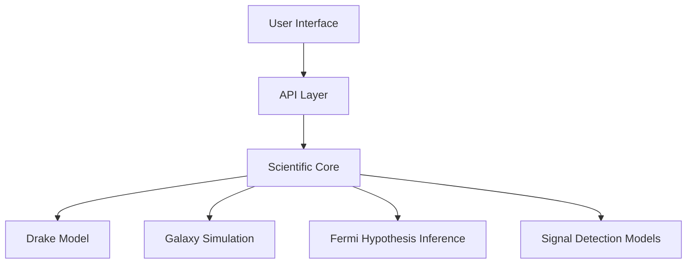

# Project Structure

## Overview

The project is structured as a **computational laboratory for exploring the Fermi Paradox**.

Core scientific workflow:

Drake Equation → Civilization Simulation → Observational Constraints → Bayesian Hypothesis Inference

The web application exposes these models through an interactive interface while keeping
scientific logic isolated from the web framework.


```mermaid
graph TD;
    A[User Interface] --> B[API Layer]
    B --> C[Scientific Core]
    C --> D[Drake Model]
    C --> E[Galaxy Simulation]
    C --> F[Fermi Hypothesis Inference]
    C --> G[Signal Detection Models]
```

---

## Repository Layout

```text
fermi_paradox/
│
├── src/
│   ├── fermi_paradox/
│   │   │
│   │   ├── __init__.py
│   │   │
│   │   ├── main.py
│   │   │       # Application entrypoint.
│   │   │       # Responsible ONLY for initializing the Flask/FastAPI app.
│   │   │       # No scientific logic or business logic should live here.
│   │   │
│   │   ├── config/
│   │   │   ├── __init__.py
│   │   │   ├── settings.py
│   │   │   │       # Global application configuration.
│   │   │   │       # Environment variables, logging, debug flags.
│   │   │   │
│   │   │   └── drake_params.py
│   │   │           # Centralized Drake Equation parameter presets.
│   │   │           # Example presets:
│   │   │           #   - Optimistic civilization scenario
│   │   │           #   - Conservative estimate
│   │   │           #   - Rare Earth hypothesis
│   │   │
│   │   ├── core/
│   │   │   │       
│   │   │   │       # -----------------------------------------
│   │   │   │       # SCIENTIFIC MODEL LAYER
│   │   │   │       # -----------------------------------------
│   │   │   │       # This layer contains the core scientific logic.
│   │   │   │       # No web framework code is allowed here.
│   │   │   │       # These modules should be importable independently.
│   │   │   │
│   │   │   ├── drake_equation.py
│   │   │   │       # Implements deterministic and Bayesian Drake models.
│   │   │   │       # Calculates estimated number of communicating civilizations.
│   │   │   │       # This forms the starting point for the rest of the pipeline.
│   │   │   │
│   │   │   ├── galaxy_simulation.py
│   │   │   │       # Monte Carlo simulation of civilizations in the galaxy.
│   │   │   │       # Uses Drake results as probabilistic inputs.
│   │   │   │       # Can generate spatial distributions, civilization timelines,
│   │   │   │       # and expected observational patterns.
│   │   │   │
│   │   │   ├── fermi_inference.py
│   │   │   │       # Bayesian inference engine for the Fermi Paradox.
│   │   │   │       #
│   │   │   │       # Uses:
│   │   │   │       #   - Civilization distributions
│   │   │   │       #   - Observational constraints
│   │   │   │       #   - Hypothesis priors
│   │   │   │       #
│   │   │   │       # Computes posterior probabilities for explanations such as:
│   │   │   │       #   H1 Life is rare
│   │   │   │       #   H2 Intelligence is rare
│   │   │   │       #   H3 Civilizations self-destruct
│   │   │   │       #   H4 Interstellar expansion is difficult
│   │   │   │       #   H5 Civilizations avoid detection
│   │   │   │       #   H6 Humanity is early
│   │   │   │
│   │   │   ├── probability_models.py
│   │   │   │       # Signal detection probability tools.
│   │   │   │       # Statistical models used to evaluate whether a signal
│   │   │   │       # is likely natural or artificial.
│   │   │   │       # This supports the future "Probability Detection" page.
│   │   │   │
│   │   │   └── visualization.py
│   │   │           # Plotting utilities for scientific outputs.
│   │   │           # Examples:
│   │   │           #   - Drake result histograms
│   │   │           #   - Galaxy civilization maps
│   │   │           #   - Hypothesis posterior charts
│   │   │
│   │   ├── ml/
│   │   │   │
│   │   │   │       # -----------------------------------------
│   │   │   │       # OPTIONAL MACHINE LEARNING MODULES
│   │   │   │       # -----------------------------------------
│   │   │   │
│   │   │   ├── surrogate/
│   │   │   │       # ML models that approximate simulation results.
│   │   │   │       # Example: predicting galaxy simulation outcomes
│   │   │   │       # without running expensive Monte Carlo simulations.
│   │   │   │
│   │   │   └── signal_detection/
│   │   │           # Future CNN or signal processing models.
│   │   │           # Intended for classifying potential SETI signals.
│   │   │
│   │   ├── api/
│   │   │   │
│   │   │   │       # -----------------------------------------
│   │   │   │       # WEB APPLICATION LAYER
│   │   │   │       # -----------------------------------------
│   │   │   │
│   │   │   ├── forms/
│   │   │   │   │   # User input forms.
│   │   │   │   │
│   │   │   │   ├── drake_form.py
│   │   │   │   ├── galaxy_simulation_form.py
│   │   │   │   └── signal_detection_form.py
│   │   │   │
│   │   │   ├── controllers/
│   │   │   │   │   # Business logic connecting web requests
│   │   │   │   │   # to the scientific model layer.
│   │   │   │   │   #
│   │   │   │   │   # Controllers call functions inside core/.
│   │   │   │   │
│   │   │   │   ├── drake_controller.py
│   │   │   │   ├── galaxy_simulation_controller.py
│   │   │   │   ├── fermi_hypothesis_controller.py
│   │   │   │   └── signal_detection_controller.py
│   │   │   │
│   │   │   ├── routes/
│   │   │   │   │   # HTTP route definitions.
│   │   │   │   │   # Routes should be thin and delegate to controllers.
│   │   │   │   │
│   │   │   │   └── routes.py
│   │   │   │
│   │   │   └── schemas.py
│   │   │           # Optional request/response validation schemas.
│   │   │
│   │   ├── templates/
│   │   │   │
│   │   │   │       # -----------------------------------------
│   │   │   │       # USER INTERFACE
│   │   │   │       # -----------------------------------------
│   │   │   │
│   │   │   ├── base/
│   │   │   │   ├── base.html
│   │   │   │   └── home.html
│   │   │   │
│   │   │   ├── drake/
│   │   │   │   └── drake.html
│   │   │   │       # Deterministic Drake calculator.
│   │   │   │
│   │   │   ├── fermi/
│   │   │   │   └── hypothesis_model.html
│   │   │   │       # Displays Bayesian hypothesis results.
│   │   │   │
│   │   │   ├── galaxy_simulator/
│   │   │   │   └── galaxy_simulator.html
│   │   │   │       # Visualization of civilization simulations.
│   │   │   │
│   │   │   └── signal_detection/
│   │   │       └── signal_detection.html
│   │   │           # Signal probability exploration tools.
│   │   │
│   │   ├── static/
│   │   │       # CSS, JavaScript, images.
│   │   │
│   │   └── utils/
│   │       ├── math_helpers.py
│   │       ├── formatters.py
│   │       └── plot_utils.py
│   │
│   └── tests/
│       # Unit and integration tests.
│
├── research/
│   │
│   │   # -----------------------------------------
│   │   # EXPERIMENTAL RESEARCH WORKSPACE
│   │   # -----------------------------------------
│   │
│   ├── notebooks/
│   ├── references/
│   └── data/
│
├── docs/
│   │
│   │   # -----------------------------------------
│   │   # PROJECT DOCUMENTATION
│   │   # -----------------------------------------
│   │
│   ├── 00_project_overview/
│   ├── 01_architecture/
│   ├── 02_technical_documentation/
│   ├── 03_user_guides/
│   ├── 04_api_documentation/
│   ├── 05_scientific_theory/
│   ├── 06_development_notes/
│   └── 07_assets/
│
├── run.py
├── README.md
├── LICENSE
├── pyproject.toml
├── Procfile
└── pytest.ini
```

---

## Final Architectural Intent

The project intentionally separates:

| Layer | Responsibility |
| ------ | ------ |
| **core/** | Scientific models and simulations |
| **api/** | Web interface and request handling |
| **templates/** | User interface |
| **research/** | Experimental work and notebooks |
| **docs/** | Scientific and architectural documentation |

This separation ensures the scientific models remain reusable outside the web application.
