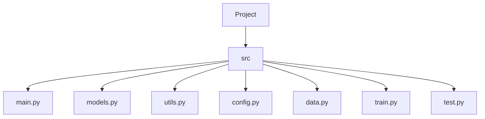

# Project Structure

## Overview



## Structure

```mermaid
fermi_paradox/
├── src/
│   ├── fermi_paradox/
│   │   ├── __init__.py
│   │   ├── main.py                # App entrypoint (Flask or FastAPI instance)
│   │   ├── config/
│   │   │   ├── __init__.py
│   │   │   ├── settings.py        # Environment, constants, logging config
│   │   │   └── drake_params.py    # Drake equation constants + models
│   │   ├── core/
│   │   │   ├── __init__.py
│   │   │   ├── drake_equation.py  # Core logic & math
│   │   │   ├── galaxy_simulator.py# Simulation + data generation
│   │   │   ├── prob_detection.py  # Probability functions & modeling
│   │   │   └── visualization.py   # (Optional) Matplotlib/Plotly galaxy maps
│   │   ├── api/
│   │   │   ├── __init__.py
│   │   │   ├── routes.py          # API routes (FastAPI endpoints or Flask Blueprints)
│   │   │   └── schemas.py         # Pydantic models (FastAPI) or Marshmallow (Flask)
│   │   ├── templates/             # Jinja2 HTML templates
│   │   │   ├── base.html
│   │   │   ├── index.html
│   │   │   └── results.html
│   │   ├── static/
│   │   │   ├── css/
│   │   │   ├── js/
│   │   │   └── images/
│   │   └── utils/
│   │       ├── __init__.py
│   │       ├── math_helpers.py
│   │       ├── formatters.py
│   │       └── plot_utils.py
│   └── tests/
│       ├── __init__.py
│       ├── test_drake_equation.py
│       ├── test_prob_detection.py
│       └── test_api.py
│
├── docs/
│   ├── README_faq.md
│   ├── dev_diary/
│   │   ├── architecture_notes.md
│   │   └── refactor_log.md
│   └── assets/
│       └── galaxy_diagram.png
│
├── .env
├── .gitignore
├── LICENSE
├── pyproject.toml / requirements.txt
├── README.md
└── run.py                    # Shortcut to start app (`python run.py`)
```

